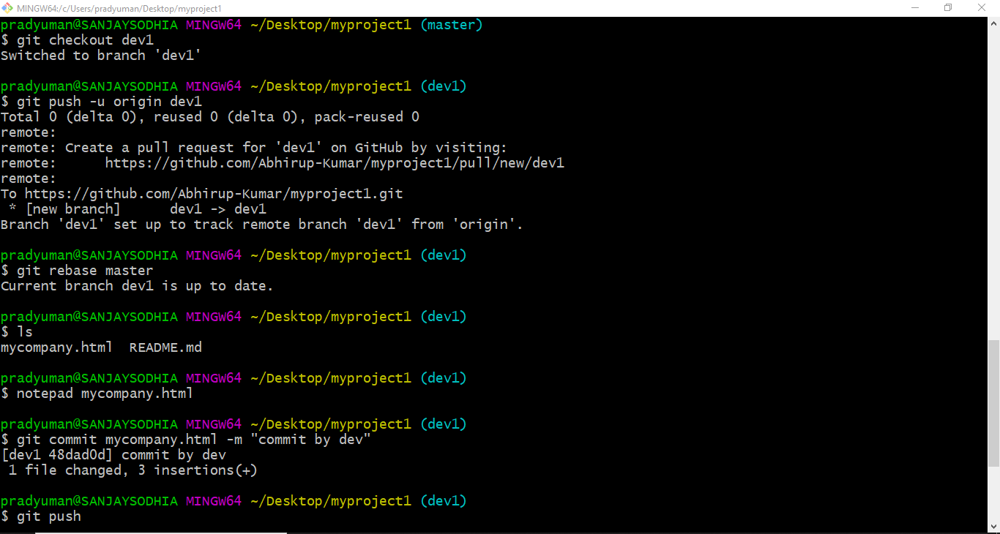
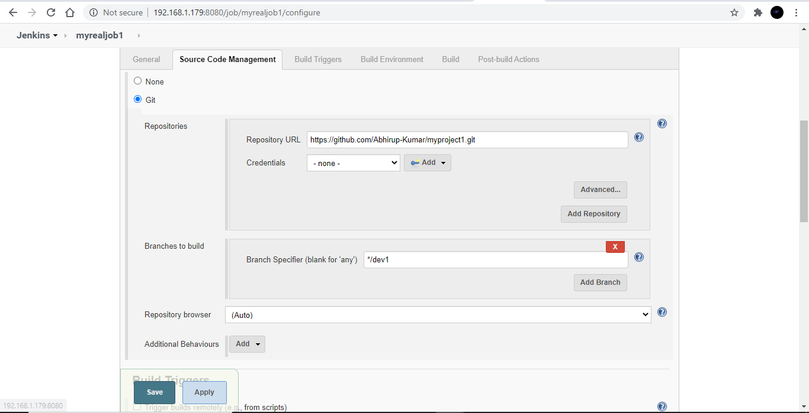
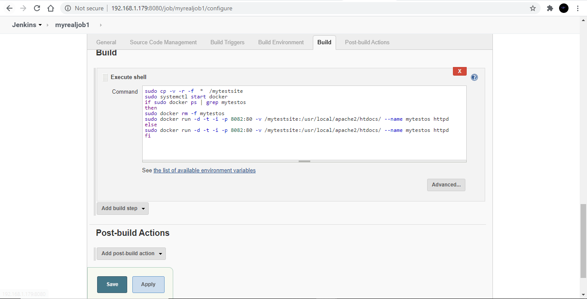
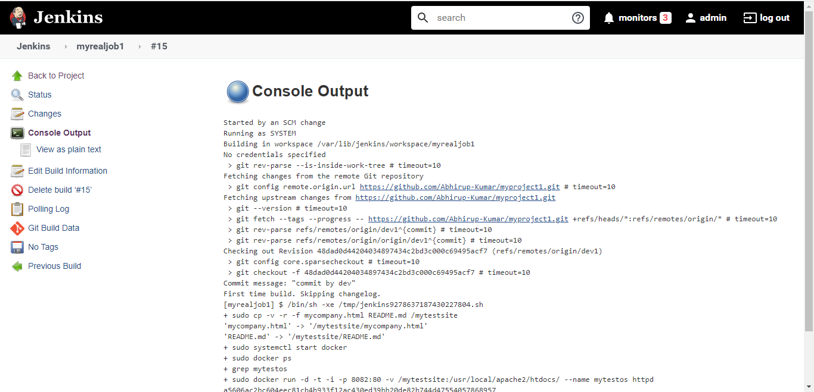
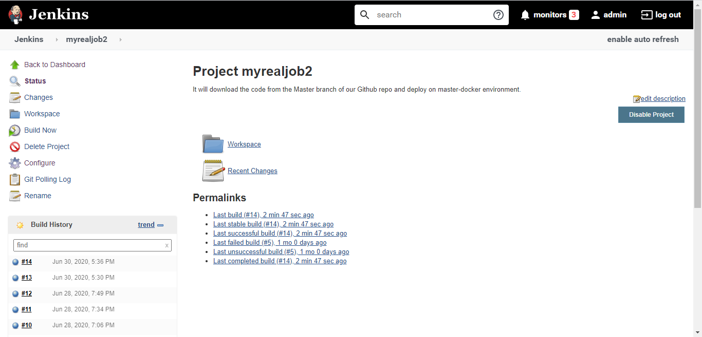
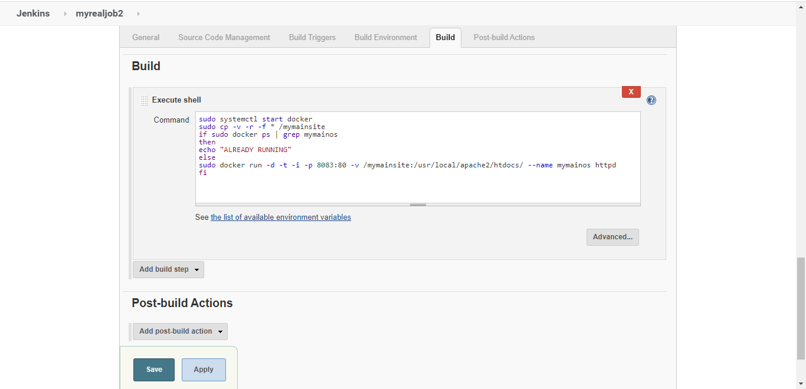
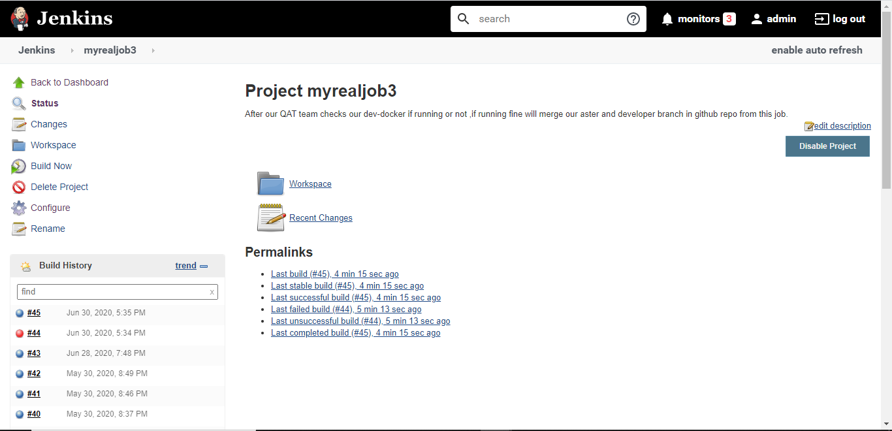
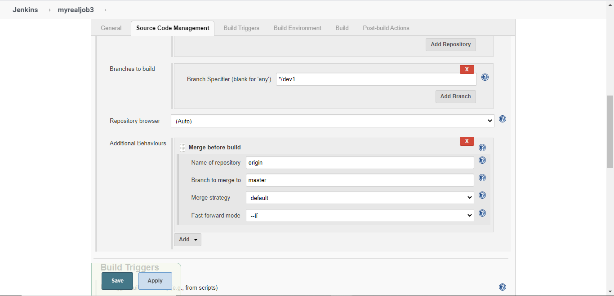
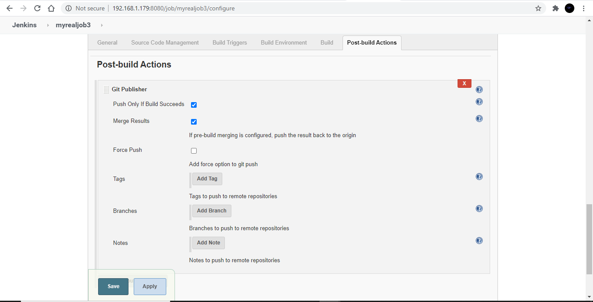
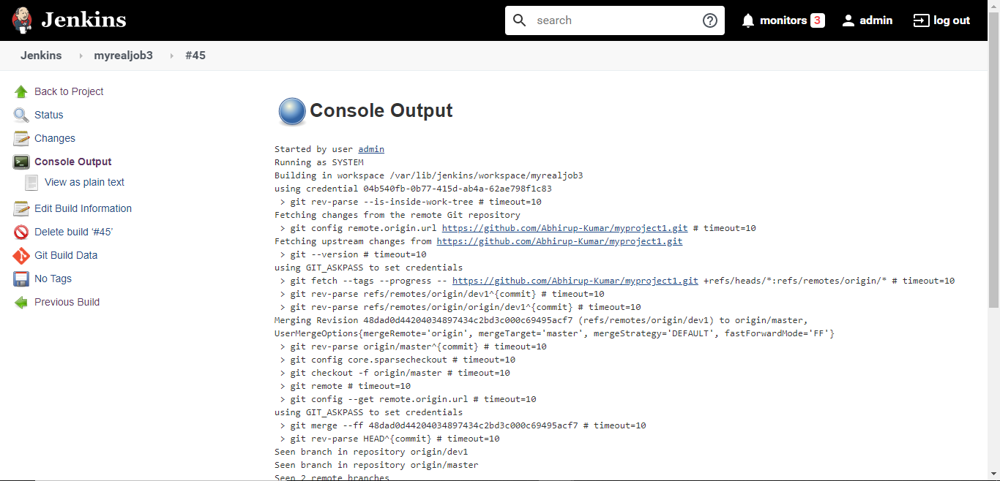

# Orchestration
Orchestration is the automated configuration, coordination, and management of computer systems and software.
Project showing the concept of orchestration with a real world use case where first code written by developer have to be tested by QAT and only after testing deployed to our main website so that no problem occurs to production site of our company.

# Project Explanation
In this project we are going to launch two containers with httpd server already installed on them .One container will be our QAT team server on which first any changes made by developer in developer branch will be launched. Another container will be our main production site on which only after passing testing by our QAT team changes will be made on it after that. It will all be automatic as we are using Jenkins as our CI/CD  tool and Docker as our container technology which is very fast for deployment purposes.
We created various jobs to deal with this problem in step by step manner.

## Job1 (TEST SITE)

It will launch the container with httpd webserver image on it .It will be our QAT team server as only code committed to developer branch will deployed here only. QAT will make sure if it is good to go or not and further actions will be decided on their decision only.

## Job2 (PRODUCTION SITE)

It will launch another container with httpd server image. It will be our main production site and our company’s forefront for business. Only changes committed to master branch will be deployed here after only  thorough  inspection by our QAT.

## Job3 (BRANCH MERGER)

It will be most important job of all the jobs as after gone through inspection by QAT the developer branch will be merged to Master branch thereby automatically triggering the JOB2 again and deploying the changes on main site after that only.

